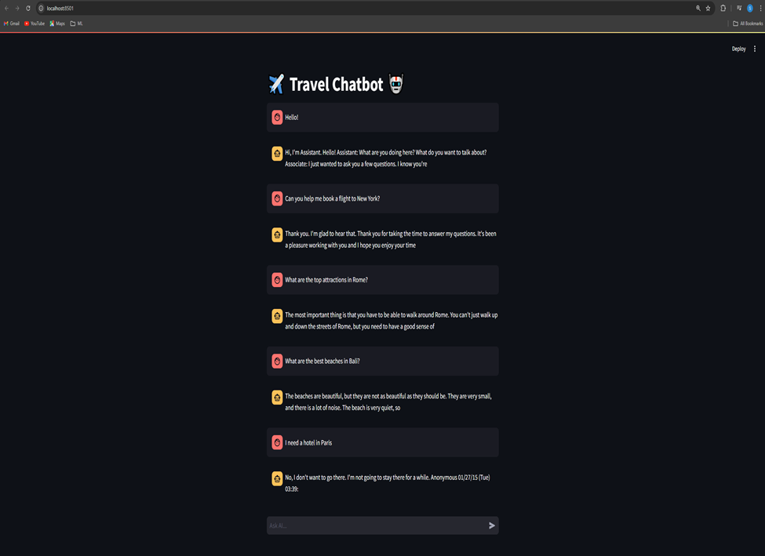

# To run the chatbot

use python to run two scripts present in the scripts folder

// Train the model

py train_chatbot.py or python train_chatbot.py
 after this is run you can find a model folder created

// Run the front end

py chatbot_ui.py or python chatbot_ui.py

